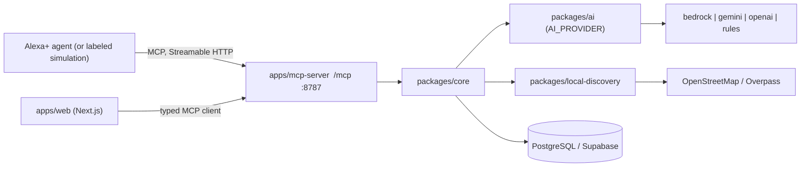

# Architecture

The web app and the Alexa+ agent use the same MCP tools. There is no second code path.

## Planner loop (Phase 3)

`observe -> decide -> call tool -> update state -> repeat`, max 8 steps per run (`packages/agent`). The planner stops early when evidence is sufficient and asks a clarifying question when ambiguity materially changes the result (top confidence < 0.75, alternatives in different categories, missing location, urgency, unknown compatibility).

## Identification order

1. exact alias match 2. trigram match 3. category + use-case match 4. structured inference from the configured provider 5. rules fallback. Every provider response is Zod-validated; any failure falls back to `rules` and the fallback reason is recorded in `ProviderMeta` for the agent trace.

## Data model decisions (Phase 1)

- `packages/db/migrations/*.sql` is the DDL source of truth (extensions, trigram and GIN indexes). `packages/db/src/schema.ts` mirrors columns for typed Drizzle queries. A small runner (`src/migrate.ts`) applies SQL files in order and records them in `schema_migrations`.
- `aliases` rows drive matching (exact + trigram). `products.aliases` JSONB is a denormalised copy for tool output; both are written together.
- `alternative` and `often_confused_with` are symmetric: stored once, queried in both directions. `replacement_for` reads "from is the modern replacement for to". `used_with` and `compatible_with` are directional.
- `product_evidence.observed_at` is the spec's `timestamp` (avoids a type-name column). Seed evidence is `sourceType: curated`, a statement about catalogue quality, never about store stock.
- Local-discovery cache and shopping-list tables arrive in later phases with their own migrations.

## Core services (Phase 2)

`packages/core` holds all business logic behind ports, so the MCP server (Phase 3) is a thin wrapper and the web app never duplicates it.

- **Ports** (`context.ts`): `ProductRepository`, `PlaceSource`, `Geocoder`, `PlaceStore`, `InventoryEvidenceProvider`, `EvidenceLedger`, and the AI ports `IdentifyAssist` / `CompareAssist`. Phase 5-7 supplies the real adapters (Bedrock/Gemini/OpenAI, Overpass, Nominatim, web evidence).
- **Services** (`services.ts`): `createCoreServices(ctx)` returns the handlers for `identify_product`, `search_products`, `discover_local_places`, `check_local_inventory`, `compare_products`, `get_place_details`, `get_directions`, `contact_store`. `create_shopping_list` (needs a table) and `search_web` follow in Phases 3 and 7.
- **Catalogue**: loaded once from Postgres (`@veylo/core/pg`), indexed in memory and refreshed on a TTL. Matching runs in-process rather than via SQL `similarity()`; the trigram indexes in the migration are there for the DB-side path if the catalogue outgrows memory.
- **AI as an assist, not an oracle**: when an assist is configured it is called after the rules stages with the shortlist. Its answer is validated, capped (0.7 if it picks a product the rules ranked outside the top 3, 0.6 if the product is not in the catalogue), and on any error the rules result is returned with `meta.fallbackFrom` and `meta.fallbackReason`. For comparison, the AI may reword pros/cons and recommend, but availability and distance always come from collected evidence.
- **Errors**: `VeyloError` with a `code` (`NOT_FOUND`, `UNKNOWN_CATEGORY`, `GEOCODE_FAILED`, `UPSTREAM_UNAVAILABLE`, `INVALID_INPUT`) for the MCP layer to map to structured tool errors.

## MCP server, client and agent (Phase 3)

- **`apps/mcp-server`**: Express + the official SDK in stateless Streamable HTTP mode. Only three files touch the SDK/Express (`server.ts`, `http.ts`, `context.ts`/`main.ts`); everything else (config, origin/bearer guard, schema shapes, conformance client) is SDK-free and unit-tested. Tools are registered from `toolContracts`, so schemas, descriptions and handlers cannot drift. See `docs/mcp-tools.md`.
- **Tool execution layer** (`packages/core/src/tooling.ts`): validates input, runs the service, validates the output against its contract (a result that breaks its own contract, e.g. `CONFIRMED` without evidence, is withheld as `INTERNAL_ERROR`), maps `VeyloError` to a tool error, and hides internals. `decodeToolResult` is its inverse for clients.
- **`packages/mcp-client`**: typed client over the SDK's Streamable HTTP client; implements `ToolCaller`. The web app and agent use only this.
- **`packages/agent`**: the planner. It depends on a `ToolCaller`, never on services directly, so every action it takes is an MCP tool call. State is plain JSON, so a UI or an Alexa+ session can hold it between turns.
- **Wire format** lives in one place (`tooling.ts`): `structuredContent` + JSON text on success; `isError` with `_meta["veylo/error"]` on failure.
